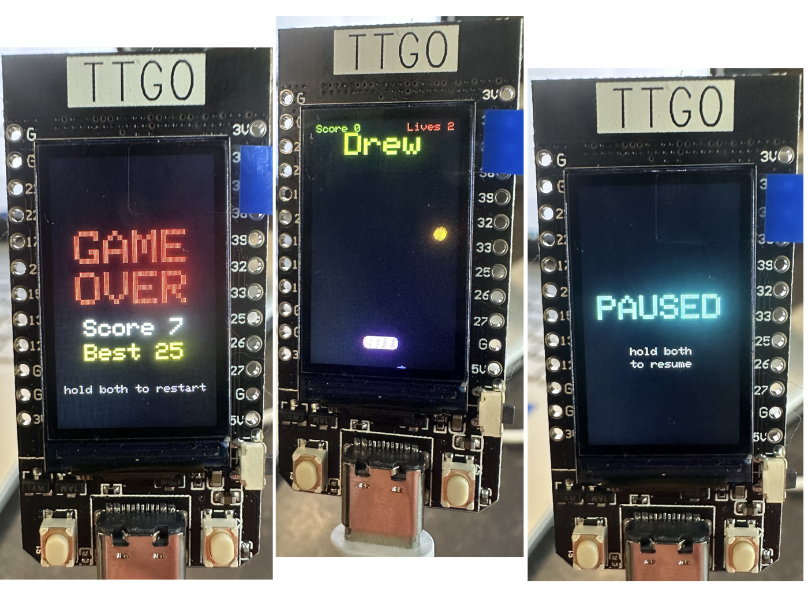

# Drew Game — "Catch the Falling Dot"

A tiny arcade game for the **LILYGO TTGO T-Display** (ESP32 + 1.14" ST7789 240×135 TFT).
Hold it phone-style (USB-C at the bottom) and catch the falling dot with the bar.

<p align="center">
  
</p>

## Gameplay
- The dot drops from the top and bounces off the side walls.
- Move the **bar** with the two buttons beside the USB-C to catch it.
- Each catch scores a point and the dot **speeds up**.
- You have **3 lives**; miss 3 dots and it's **GAME OVER**.
- Your **high score is saved to flash** (survives power-off).

## Controls
| Button | Pin | Action |
|--------|-----|--------|
| Left   | GPIO 0  | move bar left (hold) |
| Right  | GPIO 35 | move bar right (hold) |
| Both   | —   | **pause / resume** (and **restart** on the Game Over screen) |

> If left/right feel reversed for how you hold it, swap `BTN_LEFT` / `BTN_RIGHT`
> at the top of the sketch. If the screen is upside-down, change
> `tft.setRotation(0)` to `tft.setRotation(2)`.

## Hardware
- **LILYGO TTGO T-Display** (ESP32, ST7789). No wiring needed — uses the onboard
  screen and the two onboard buttons.

## Build & flash

### Requirements
1. **ESP32 board support** (Arduino IDE Boards Manager, or `arduino-cli core install esp32:esp32`).
2. The **TFT_eSPI** library, configured for the T-Display.

### Configure TFT_eSPI (one-time)
TFT_eSPI needs to know it's driving a T-Display. In the TFT_eSPI library folder,
edit `User_Setup_Select.h`: comment out the default `User_Setup.h` include and
**uncomment**:
```cpp
#include <User_Setups/Setup25_TTGO_T_Display.h>
```

### Arduino IDE
1. Tools → Board → **ESP32 Dev Module** (or "TTGO LoRa32"/"ESP32 Dev Module").
2. Open `DrewGame/DrewGame.ino`, select your port, click **Upload**.

### arduino-cli
```bash
arduino-cli compile --fqbn esp32:esp32:esp32 DrewGame
arduino-cli upload  --fqbn esp32:esp32:esp32 --port <YOUR_PORT> DrewGame
# find the port with: arduino-cli board list
```

## Tweaks
All the knobs are constants at the top of `DrewGame/DrewGame.ino`:
`BAR_W`, `BAR_SPEED`, `BALL_R`, `ballSpeed()` (difficulty ramp), starting `lives`.

## Ideas to build on (PRs welcome! 🎉)
Fork it and take it further — some fun directions:

- **Combo multiplier** — reward consecutive catches; the streak resets on a miss,
  and the score ramps faster the longer you keep it alive.
- **Bad dots to dodge** — mix in red "bad" dots; catching one costs a life (or
  ends a combo). Now the bar has to *dodge* as well as catch.
- **Difficulty visuals** — make the rising speed *feel* real: shrink the bar as
  the score climbs, add a motion trail on the ball, or shift the background hue
  with the pace.
- **Power-ups** — a rare golden dot that widens the bar, adds a life, or freezes
  time for a few seconds.
- **Two dots at once** once you're good enough, or a **level system** with
  a short "Level 2!" flash.
- **Sound** — wire a small piezo buzzer for blips on catch / miss / game over.
- **Local 2-player** — second paddle at the top, pass the device back and forth.

If you build something cool, open a PR — happy to feature it here.

## License
MIT — do whatever you like. Have fun.
